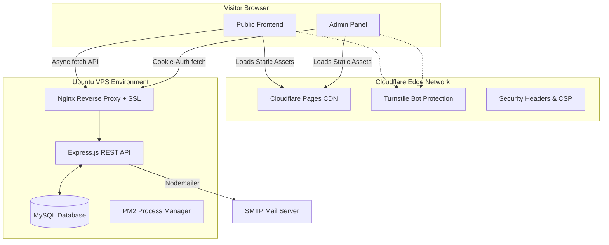

  <h1>🚀 Arraffi's Professional Portfolio</h1>
  
<strong>A bespoke, full-stack portfolio & headless CMS architecture built from scratch.</strong>

  
  
  
  
  
   

## 📑 Table of Contents
- [Project Status](#-project-status)
- [Design & Layout Philosophy](#-design--layout-philosophy)
- [System Architecture](#-system-architecture)
- [Core Features](#-core-features)
- [The Admin Control Panel](#-the-admin-control-panel)
- [Security Posture](#-security-posture)
- [Technology Stack](#-technology-stack)
- [Deployment Guide](#-deployment-guide)
- [Find Me](#-find-me)

---

## 📊 Project Status
**Active & In Production**  
This project is currently deployed and serves as the primary gateway for my professional identity. It has evolved significantly from a static site into a fully decoupled, API-driven architecture that I manage entirely through a custom-built Vue.js CMS.

**Live URL:** [https://arraffi.com](https://arraffi.com)

---

## 🎨 Design & Layout Philosophy

The UI/UX was designed around a **"Midnight & Ember"** aesthetic, focusing on readability, micro-interactions, and high performance.

### Visual Identity
- **Background:** Deep space/midnight black (`#08090d`).
- **Accents:** Ember orange (`#ff2a00` / `#ff7520`) for call-to-actions, hovers, and borders.
- **Glassmorphism:** Navigation bars and modal overlays use `backdrop-filter: blur(8px)` with semi-transparent surfaces to create depth without visual clutter.

### Layout Structure
- **Hero Section:** High-impact introduction with a terminal-inspired ASCII graphic and clear value proposition.
- **Dynamic Grids:** Projects are rendered via CSS Grid (`grid-template-columns`), automatically switching between 1-column mobile views and multi-column desktop views. 
- **Aspect Ratio Locking:** All media uses `aspect-ratio: 16/9` combined with `object-fit: cover` to ensure consistent alignment regardless of the source image size.
- **Typography:** Gradient text clips (`-webkit-background-clip: text`) are used sparingly for primary headers to draw the eye, while body text remains a high-contrast off-white (`var(--text)`).

---

## 🏗️ System Architecture

The portfolio utilizes a **Decoupled (Headless) Architecture**. The frontend is a highly optimized static site hosted on Cloudflare's Edge, which fetches data asynchronously from an Express.js API running on a private VPS.

---

## ✨ Core Features

* **Dynamic Localization:** Natively supports English (`index.html`) and Indonesian (`id/index.html`) using dedicated language columns in the database (`title_id`, `description_id`).
* **Scroll Animations:** Lightweight `IntersectionObserver` fades in elements as the user scrolls, without the overhead of heavy animation libraries.
* **Smart Contact Form:** Integrates Cloudflare Turnstile to block spam bots, securely logs messages to the database, and dispatches an email notification via SMTP.
* **Core Web Vitals Optimized:** Zero render-blocking scripts, aggressive lazy-loading (`loading="lazy"`) for all images, and strictly typed aspect ratios to prevent Cumulative Layout Shift (CLS).

---

## ⚙️ The Admin Control Panel

A completely bespoke, single-page CMS built with **Vue 3** (via CDN) and **SweetAlert2**. It acts as the nerve center for the portfolio.

- **Session Persistence:** Automatically checks for valid `HttpOnly` session cookies on mount, skipping the login screen if the administrator is already authenticated.
- **Glassmorphic Modals:** Clicking "Edit" on any project or experience entry opens a massive, 900px wide modal overlay for a distraction-free editing workspace.
- **Live Image Previews:** URL inputs instantly render image previews inside the form to verify assets before saving.
- **Message Inbox:** A dedicated tab allows the admin to read, review, and delete contact form submissions directly from the dashboard.

---

## 🛡️ Security Posture

Security was a primary focus during the v2 rewrite. The application has passed a comprehensive internal audit:

| Threat Vector | Mitigation Strategy |
|---|---|
| **XSS (Cross-Site Scripting)** | The public frontend routes all dynamic API data through a strict `escHtml()` sanitizer. URLs are validated via `safeUrl()` before injection. |
| **SQL Injection** | The Express backend relies exclusively on parameterized queries (`?`) using `mysql2/promise`. |
| **CSRF & Session Hijacking** | Admin authentication issues an `HttpOnly`, `SameSite=Strict`, `Secure` cookie. Passwords are never stored locally. |
| **Brute-Force & Credential Stuffing** | The `/api/admin/login` endpoint is protected by `express-rate-limit` (5 attempts / 10 minutes) and Cloudflare Turnstile. |
| **Header Injection** | The contact form API uses `sanitizeHeader()` to strip line breaks from inputs before passing them to Nodemailer. |
| **Information Disclosure** | The backend `catch` blocks trap all system errors (DB timeouts, SMTP failures), logging them securely to the VPS console while returning generic `500` messages to the client. |
| **Infrastructure Isolation** | Strict CORS policies and Cloudflare `_headers` enforce Content-Security-Policy (CSP), X-Frame-Options, and HSTS globally. |

---

## 💻 Technology Stack

* **Frontend:** HTML5, CSS3 (Vanilla), JavaScript (ES6+), Vue.js 3 (Admin Only)
* **Backend:** Node.js, Express.js
* **Database:** MySQL
* **Security:** Cloudflare Turnstile, bcrypt/crypto (timing-safe equivalence), express-rate-limit
* **Infrastructure:** Cloudflare Pages, Nginx, Ubuntu Server, PM2

---

## 🚀 Deployment Guide

### 1. Frontend (Cloudflare Pages)
The frontend is designed to be hosted statically on Cloudflare Pages.
1. Connect this repository to Cloudflare Pages.
2. Set the build directory to `frontend/`.
3. No build command is required.
4. Add your Turnstile Site Key to `frontend/index.html` and `frontend/admin.html`.

### 2. Backend (Ubuntu VPS)
The backend runs on an Express API managed by PM2.
1. Clone the repository on your VPS and navigate to `backend/`.
2. Run `npm install` to install dependencies.
3. Create a `.env` file based on `.env.example` and fill in your DB, SMTP, Turnstile Secret, and Admin Password.
4. Run `node init_db.js` to create the MySQL tables.
5. Start the server using PM2: `pm2 start server.js --name "portofolio-api"`.
6. Configure Nginx to reverse proxy `api.yourdomain.com` to `http://127.0.0.1:3001`.

---

## 📫 Find Me
* **Email:** [kona@konaima.my.id](mailto:kona@konaima.my.id)
* **Discord:** [@konasgor](https://discordapp.com/users/406852668028616721)
* **X (Twitter):** [@arraffianakbaik](https://x.com/arraffianakbaik)
* **Instagram:** [@konasgor](https://instagram.com/konasgor)

---
*&copy; 2026 Arraffi (Konaima). All rights reserved.*
